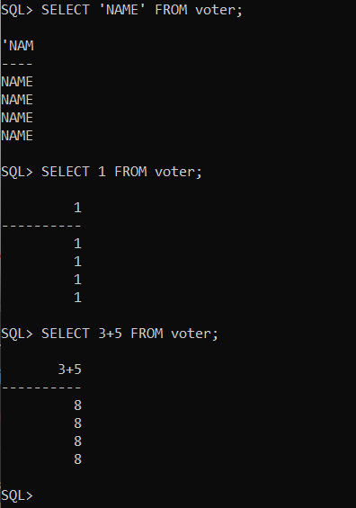

# Column Concatination
- `||` is used

`STUDENT` table
ROLLNO | NAME | BALANCE | DOB
--- | --- | --- | ---
1   | Rohit |   | 14-FEB-2001
2   | Amit |100 | 21-JAN-2001
3   | Anil |500 | 2-JUN-2000
4   |Kumar |985 | 

> Print eg:`student name is Amit and DOB is 21-JAN-2001`
```
SELECT 'My name is ' || name || ' and dob is ' || dob FROM voter;
```
after executing this line output fill be
>My name is rohit and dob is 14-FEB-01
>
>My name is Amit and dob is 21-JAN-01
>
>My name is Anil and dob is 02-JUN-00
>
>My name is Kumar and dob is 

Some examples:

if run below codes then it will be shown `N` time, where `N` is no. of rows in the table

> SELECT 'NAME' FROM VOTER;

NOTE : 'NAME' is a string not column name

> SELECT 1 FROM VOTER;

> SELECT 2+5 FROM VOTER;



