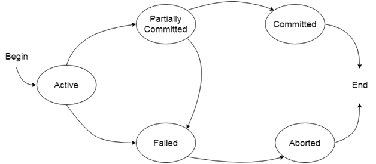
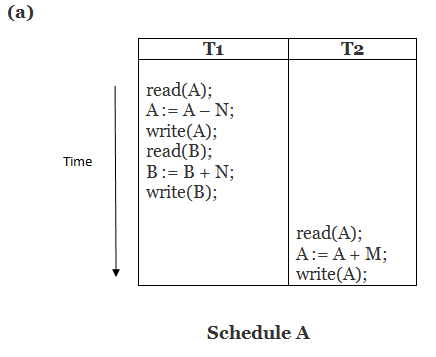
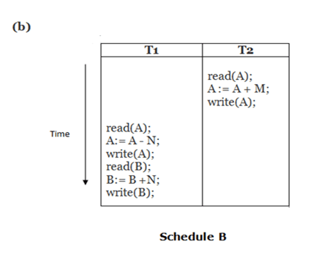
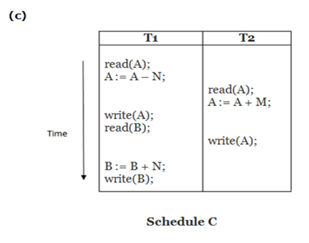
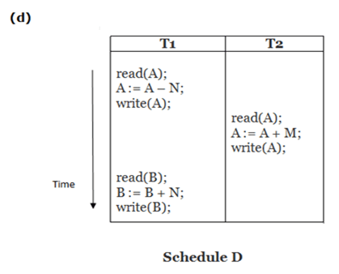
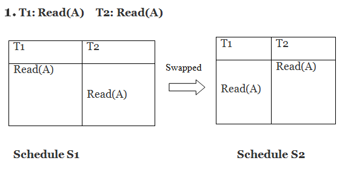
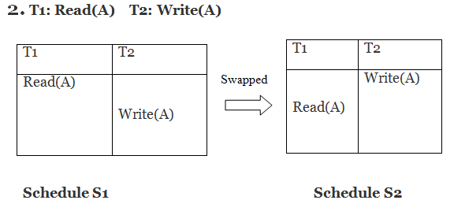
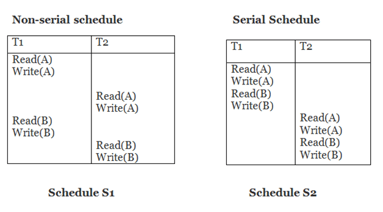
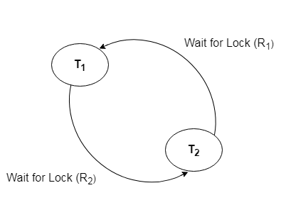

# Transaction
- It us a unit of program or a set of instructions that can access Data stored inside DBMS and can also modify it.
- Eg: 
    - Checking Account Balance
    - Withdraw Money
    - View PNR Status

    

# ACID Properties
- [Atomicity](#atomicity)
- [Consistency](#consistency)
- [Isolation](#isolation)
- [Durability](#durability)

## Atomicity
- If any operation is performed on the data, either it should be performed or executed completely or should not be executed at all.
- i.e. the operation should not break in between or execute partially
- In the case of executing operations on the transaction, the operation should be completely executed and not partially.
- Eg: 
    - Fund transfer from A to B, what if power fails after amount deduction from A but not transferred to B??
    - money will be lost

## Consistency
- The word consistency means that the value should remain preserved always.
- In DBMS, the integrity of the data should be maintained, which means if a change in the database is made, it should remain preserved always.

## Isolation
- Isolation is the property of a database where no data should affect the other one and may occur at the same time.
- the operation on one database should begin when the operation on the first database gets complete

## Durability
- Once a transaction completes successfully, the changes it has made to the database remains committed, even if there are system failures.

# Concurrent Executions
- multiple transactions are allowed to run concurrently in the system.
- Advantages are:
    - **Increades processor and disk utilization**.[leading to better transaction throughput (i.e output)]
        - Eg: one transaction can use the CPU while another can read from or write to the disk
    - **Reduced average waiting time** for transactions : short transactions need not wait behind long ones.

## Schedules
- A series of operation from one transaction to another transaction is known as schedule. 
- It is used to preserve the order of the operation in each of the individual transaction.

### Serial Execution
- execution is in serial (one after other)
- see fig. one transaction is executed after other (i.e in serial)

T1 = transaction 1  
T2 = transaction 2

  
  

### Non-Serial Execution
- execution is not in serial
- Problems that may occur if not controlled
    - lost update problem
    - inconsistent read problem
- see fig. one transaction is executed sometimes then other then again same transaction is executed (i.e not in serial)

T1 = transaction 1  
T2 = transaction 2

  
  

# Transaction Serializability
- A schedule `S` is serializable if it is equivalent to some serial schedule of same n transactions.
- A non-serial schedule will be serializable if its result is equal to the result of its transactions executed serially.

  

In above fig. 1st traction is executed then 2nd transaction is executed and then again 1st transaction is executed.
as results are saved before switching so results will be same.

## Conflict
- A schedule is called conflict serializability if after swapping of non-conflicting operations, it can transform into a serial schedule.
- The schedule will be a conflict serializable if it is conflict equivalent to a serial schedule.

Two operations become conflicting if all conditions satisfy :
- Both belong to separate transactions
- They have the same data item.
- They contain at least one write operation.

1st swap the operations of T1 and T2
- if there is no change then it is not conflict serializable
- if there is change then it is conflict serializable

  
  

Here, `S1 = S2`. That means it is non-conflict.

  

Here, `S1  ≠ S2`. That means it is conflict.

- Two schedules are said to be conflict equivalent if the order of any two conflicting operations is same in both the schedules.
- we can say that a schedule S is conflict serializable if it is conflict equivalent to serial schedule `S` . In such case we can reorder the NON-CONFLICTING operations `S` until we form the equivalent serial Schedule `S`.

  

Schedule `S2` is a serial schedule because, in this, all operations of `T1` are performed before starting any operation of `T2`. Schedule `S1` can be transformed into a serial schedule by swapping non-conflicting operations of `S1`.

---

# Locking Protocols in Transaction (Concurrency)
- In this type of protocol, any transaction cannot read or write data until it acquires an appropriate lock on it.

- There are two types of locks:
    - [Shared lock](#shared-lock)
    - [Exclusive lock](#exclusive-lock)

## Shared Lock
- It is also called as Read-only lock.
- In this data can only read by the transaction.
- It can be shared between the tranasctions because when the transaction holds a lock, then it can't update the data on the data item.
- `LockS` operation is used

## Exclusive Lock
- In the exclusive lock, the data item can be both reads as well as written by the transaction.
- This lock is exclusive, and in this lock, multiple transactions do not modify the same data simultaneously.
- `LockX` operation is used

## Simple lock

# Dead Lock
- Dead lock is a situation where two or more transactions are waiting for each other to acquire a lock.
- Suppose there is a table and two users are using the same table at same time, and 1st user has deleted some rows and he has not committed the changes, then if 2nd user tries to delete the same rows, then it will lead to dead lock.
- to avoid dead lock 1st user has to commit the changes[i.e releasing lock] and then 2nd user can delete the rows[nothing will happen as data is already deleted].

## Deadlock Avoidance
- When a database is stuck in a deadlock state, then it is better to avoid the database rather than aborting or restating the database. This is a waste of time and resource.
- Deadlock avoidance mechanism is used to detect any deadlock situation in advance. A method like `wait for graph"` is used for detecting the deadlock situation but this method is suitable `only for the smaller database`. For the `larger database`, `deadlock prevention` method can be used.

## Deadlock Detection

### Wait for graph
- This is the suitable method for deadlock detection. In this method, a graph is created based on the transaction and their lock. If the created graph has a cycle or closed loop, then there is a deadlock.
- The wait for the graph is maintained by the system for every transaction which is waiting for some data held by the others. The system keeps checking the graph if there is any cycle in the graph.

  

# Failure Classification
- **Transaction failure :**
    - Logical errors : transaction is aborted due to logical error
    - system errors : transaction is aborted due to system error(eg. deadlock)
- **System Crash :**  a power failure or other hardware or software failure causes the system to crash.
- **Disk Failure :** a head crash or similar disk failure destroys all or part of disk storage.

## Recovery Algorithms
- are techniques used to recover data from a crash or failure.
- recovery algorith has two parts:
    - action taken during normal transaction 
    - action taken after a failure to recover the database

# Storage Structure
## Volatile Storage
- data is not permanently stored in the disk.(eg. RAM)
- doees not survive system crashes
- examples: main memory, cashe memory
## Non-Volatile Storage
- data is stored permanently in the disk.(eg. hard disk)
- survives system crashes
- examples : disk, tape, flash memory
## Stable Storage
- Storage in which information is never lost
- by using multiple copies of the data, it is possible to recover from a failure

# Recovery And Atomicity
- [Log-based recovery](#log-based-recovery)
- [Shadow Paging](#shadow-paging)

## Log Based Recovery
- Log is a sequence of records, which maintains the records of actions performed by a transaction.
- It is important that the logs are written prior to the actual modification and stored on a stable storage media, which is failsafe.

## Shadow Paging
